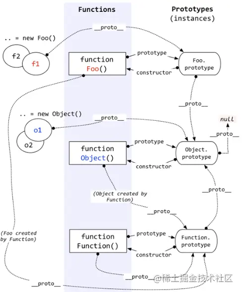
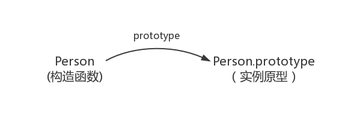
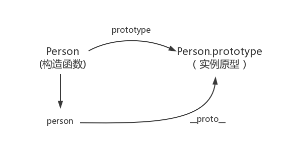
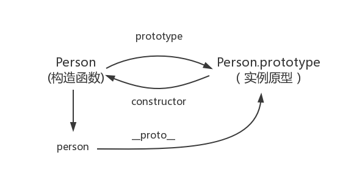
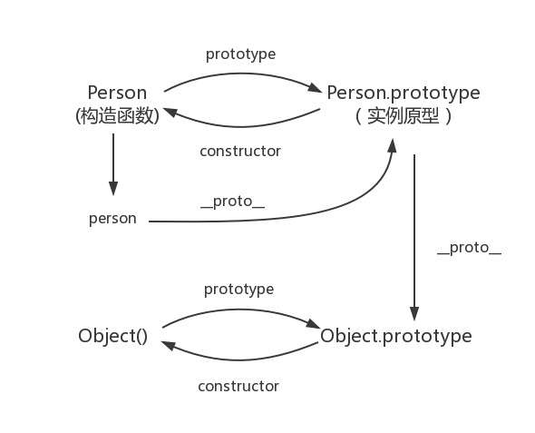
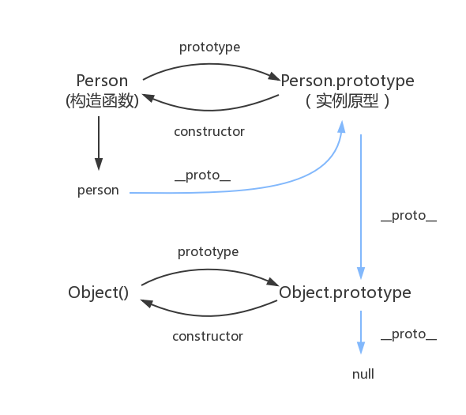

# 原型和原型链



### 1、为什么需要原型及原型链？

### **原型的作用，是用来存放实例中共有的那部份属性、方法，可以大大减少内存消耗。**

例子： 

```jsx
function Person(name, age) {
  this.name = name;
  this.age = age;
  this.eat = function() {
    console.log(age + "岁的" + name + "在吃饭。");
  }
}

let p1 = new Person("KangKang", 26);
let p2 = new Person("ChaseWindYoungs", 26);

console.log(p1.eat === p2.eat); // false
```

对于同一个函数，我们通过 `new` 生成出来的实例，都会开出新的一块堆区，但是大量的新建实例，会 消耗内存，导致内存不足。

因此，建个类似于共享库的对象，这样就可以在需要的时候，调用一个类似共享库的对象，让实例能够沿着某个线索去找到自己归处。

而这个线索，在前端中就是原型链 `prototype`。

```jsx
function Person(name) {
  this.name = name;
}

// 通过构造函数的 Person 的 prototype 属性找到 Person 的原型对象
Person.prototype.eat = function() {
  console.log("吃饭");
}

let p1 = new Person("KangKang", 26);
let p2 = new Person("ChaseWindYoungs", 26);

console.log(p1.eat === p2.eat); // true  
```

### 2、****prototype 与 __proto__****

- **例子🌰**
    
    ```jsx
    function Person() {}
    
    // 虽然写在注释里，但是你要注意：
    // prototype是函数才会有的属性
    Person.prototype.name = 'KangKang';
    
    var person1 = new Person();
    
    console.log(person1.name) // KangKang
    
    console.log(person1.prototype) // undefined
    
    console.log(person1.__proto__) // {name: 'KangKang', constructor: ƒ}
    
    console.log(Person.prototype) // {name: 'KangKang', constructor: ƒ}
    
    console.log(person1.__proto__ === Person.prototype) // true
    
    console.log(Person.prototype.constructor) // ƒ Person() {}
    
    // 顺便学习一个ES5的方法,可以获得对象的原型
    console.log(Object.getPrototypeOf(person) === Person.prototype) // true
    ```
    
- **prototype**
    - **prototype是函数才会有的属性**，函数的 prototype 属性指向了一个对象，这个对象正是调用该构造函数而创建的**实例**的原型
    - 什么是  **原型**  呢？每一个JavaScript对象(null除外)在创建的时候就会与之关联另一个  **对象**  ，这个对象就是我们所说的原型，每一个对象都会从原型"继承"属性。
    - 构造函数和实例原型之间的关系
        
        
        
- ****__proto__****
    
    每一个JavaScript对象(除了 null )都具有的一个属性，叫__proto__，这个属性会指向该对象的原型。
    
    如 `person1.__proto__ = Person.prototype`
    
    
    
- ****constructor****
    
    既然实例对象和构造函数都可以指向原型，那么原型是否有属性指向构造函数或者实例？
    
    是没有属性指向实例的，因为一个构造函数可以生成多个实例，但是原型指向构造函数是有的，
    
    每个原型都有一个 constructor 属性指向关联的构造函数。
    
    如 `Person.prototype.constructor = Person`
    
    
    
    <aside>
    💡 绝大部分浏览器都支持这个非标准的方法访问原型，然而它并不存在于 Person.prototype 中，实际上，它是来自于 Object.prototype ，与其说是一个属性，不如说是一个 getter/setter，当使用 obj.**proto** 时，可以理解成返回了 Object.getPrototypeOf(obj)。
    
    </aside>
    
    补充：
    
    ```jsx
    function Person() {
    
    }
    var person = new Person();
    console.log(person.constructor === Person); // true
    
    当获取 person.constructor 时，其实 person 中并没有 constructor 属性,
    当不能读取到constructor 属性时，会从 person 的原型也就是 Person.prototype 中读取，正好原型中有该属性，
    
    所以：
    person.constructor === Person.prototype.constructor
    ```
    
- **实例与原型**
    
    当读取实例的属性时，如果找不到，就会 **查找与对象关联的原型中的属性** ，
    
    如果还查不到，就去找原型的原型，一直找到最顶层为止。
    
    例子🌰
    
    ```jsx
    function Person() {}
    
    Person.prototype.name = 'Michael';
    
    var person = new Person();
    
    person.name = 'KangKang';
    console.log(person.name) // KangKang
    
    delete person.name;
    console.log(person.name) // Michael
    ```
    
    万一还没有找到呢？原型的原型又是什么呢？
    
- ****原型的原型****
    
    例子🌰 (万物指向终点 Object)
    
    ```jsx
    function Person() {
    
    }
    Person.prototype.name = 'Kevin';
    
    var person = new Person();
    
    person.name = 'Daisy';
    console.log(person.name) // Daisy
    
    delete person.name;
    console.log(person.name) // Kevin
    
    delete Person.prototype.name
    
    console.log(person.name) // undefined
    
    // 在 Object 原型上添加方法
    Object.prototype.name = 'KangKang'
    console.log(Person.prototype.name) // KangKang
    
    console.log(person.name) // KangKang
    ```
    
    原型也是一个对象，既然是对象，我们就可以用最原始的方式创建它
    
    原型对象就是通过 Object 构造函数生成的，结合之前所讲，实例的 **proto** 指向构造函数的 prototype
    
    
    
- ****原型链****
    
    那 Object.prototype 的原型呢？
    
    null，我们可以打印：
    
    ```jsx
    console.log(Object.prototype.__proto__ === null) // true
    ```
    
    然而 null 究竟代表了什么呢？
    
    引用阮一峰老师的 [《undefined与null的区别》](http://www.ruanyifeng.com/blog/2014/03/undefined-vs-null.html) 就是：
    
    > null 表示“没有对象”，即该处不应该有值。
    > 
    
    所以 Object.prototype.__proto__ 的值为 null 跟 Object.prototype 没有原型，其实表达了一个意思。
    
    所以查找属性的时候查到 Object.prototype 就可以停止查找了。
    
    图中由相互关联的原型组成的链状结构就是原型链，也就是 蓝色 的这条线。
    
    
    

### 3、**构造函数**

- 1）**实例成员 和 静态成员**
    
    **实例成员：** 实例成员就是在构造函数内部，通过this添加的成员。实例成员只能通过实例化的对象来访问。
    
    **静态成员：** 在构造函数本身上添加的成员，只能通过构造函数来访问
    
    ```jsx
    function Person(name,age) {
        //实例成员
        this.name = name;
        this.age = age;
    }
    
    //静态成员
    Person.sex = '女';
    
    let person = new Person('小红',18);
    
    console.log(person);      // Star {name: "小红", age: 18}
    console.log(person.sex);  // undefined     实例无法访问sex属性
    
    console.log(Person.name); //Star     通过构造函数无法直接访问实例成员
    console.log(Person.sex);  //女       通过构造函数可直接访问静态成员
    ```
    
- 2）**通过构造函数创建对象**
    
    该过程也称作实例化
    
    （1）**如何通过构造函数创建一个对象？**
    
    new 关键字
    
    ```jsx
    function Father(name) {
       this.name = name;
    }
    let son = new Father('Lisa');
    console.log(son); //Father {name: "Lisa"}
    ```
    
    （2）**new一个新对象的过程，发生了什么？**
    
    - 创建一个空对象 son `{}`
    - 为 son 准备原型链连接 `son.__proto__ = Father.prototype`
    - 重新绑定this，使构造函数的this指向新对象 `Father.call(this)`
    - 为新对象属性赋值 `son.name`
    - 返回this `return this`，此时的新对象就拥有了构造函数的方法和属性了
    
    （3）**每个实例的方法是共享的吗？**
    
    在构造函数上直接定义方法（不共享）
    
    ```jsx
    function Star() {
        this.sing = function () {
            console.log('我爱唱歌');
        }
    }
    
    let stu1 = new Star();
    let stu2 = new Star();
    
    stu1.sing();//我爱唱歌
    stu2.sing();//我爱唱歌
    
    console.log(stu1.sing === stu2.sing);//false
    
    **很明显，stu1 和 stu2 指向的不是一个地方。
    在构造函数上通过this来添加方法的方式来生成实例，每次生成实例，都是新开辟一个内存空间存方法。
    这样会导致内存的极大浪费，从而影响性能。**
    ```
    
    通过原型添加方法（共享）
    
    ```jsx
    function Star(name) {
        this.name = name;
    }
    
    Star.prototype.sing = function () {
        console.log('我爱唱歌', this.name);
    };
    
    let stu1 = new Star('小红');
    let stu2 = new Star('小蓝');
    
    stu1.sing();//我爱唱歌 小红
    stu2.sing();//我爱唱歌 小蓝
    
    console.log(stu1.sing === stu2.sing);//true
    
    **构造函数通过原型分配的函数，是所有对象共享的。**
    ```
    
    （4）**定义构造函数的规则**
    
    公共属性定义到构造函数里面，公共方法放到原型对象身上。
    
- 3）**补充**
    
    普通函数与构造函数的区别
    
    - 有new与无new的差别
    - 写法上,构造函数首字母大写(目的只是用于区分普通函数与构造函数,提醒你在创建实例化对象前加new操作符)
    - 当函数没有被new调用时,构造函数中的this指向的是全局this对象(即window)
    - 加了use strict,在严格模式下，还会报,严格模式下,并没有全局对象设置this,返回的是undefined

### 4、概念、准则、概括

4个概念

1. js 分为 函数对象 和 普通对象， 每个对象都有 __proto__ 属性，但是只有函数对象本身有 prototype 属性，
2. Object、Function 都是JS 的内置的函数， 类似的还有经常用到的 Array、RegExp、Data、Boolean、Number、String
3. 属性 __proto__  是一个对象，它有两个属性，constructor 和 __proto__
4. 原型对象 prototype 有一个默认的constructor属性，用于记录实例是由哪个构造函数创建

2个准则

1. 原型对象（即Object.prototype）的constructor指向构造函数本身
2. 实例（即XXObject）的__proto__和原型对象指向同一个地方

1个总结

所有的构造函数都是Function的实例，所有的原型对象都是Obejct的实例，除了Object.prototype

### 5、扩展

- 🌰 1: **原型被重写**
    
    实例的原型是在构造函数被调用的时候自动赋值的，它指向的是构造函数的原型对象，
    
    当构造函数P的原型被重写了，会切断构造函数与原型之间的联系，
    
    原型被重写后，再创建新的实例，那么这个新的实例指向的是被重写的那个原型，
    
    ```jsx
    function P() {}
    var p1 = new P();
    
    P.prototype.age = 18;
    
    P.prototype = {
    	constructor: P,
    	name: 'zz'
    }
    
    P.prototype.num = 20;
    P.prototype.age = 20;
    
    console.log(p1.name);
    console.log(p1.age, 'dd');
    console.log(p1.num); //undefined
    
    var p2 = new P();
    console.log(p2.name);
    ```
    
- 🌰2: **proto 是否标准**
    
    `__proto__` 是一个非 `es` 标准的属性，它对应的是 `es` 标准中的 `[[prototype]]`，因为 `[[prototype]]` 是一个内部属性，无法直接访问，所以 `es6` 中提供了 `Object.getPrototypeOf/Object.setPrototypeOf` 来读取、操作 `[[prototype]]`，所以文章说 `__proto__` 实际是 `getter/setter`，即
    
    ```jsx
    obj.__proto__
     ===> 
    get __proto__ = function() { return Object.getPrototypeOf(this) }
    set __proto__ = function(newPrototype) { return Object. setPrototypeOf(this, newPrototype) }
    ```