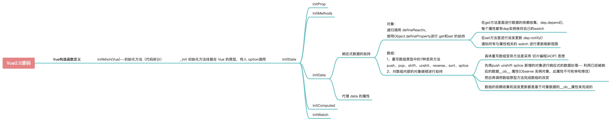

# 响应式数据的原理
## 1.数据初始化
#### vue 项目中的 main.js
```javascript
new Vue({
  el: "#app",
  router,
  store,
  render: (h) => h(App),
});

```
 Vue 实例化的过程，从 new 操作符可以看出 Vue 其实就是一个构造函数，传入的参数就是一个对象，叫做 options（选项）

#### Vue 代码类型
因为Vue是一个类，所以Vue 需要很多原型上的方法提供使用，
但是因为需要模块化这个类，因此需要写成普通的 function，
`function Vue() { ... }`
再在 Vue.prototype 上增加方法，
即便是写成 class Vue的方式，在经过babel转译后，还是 function
#### initMixin-细致拆分
用于将所有的Vue初始化工作拆分的更细致
```javascript
import { initMixin } from "./init.js";

// Vue就是一个构造函数 通过new关键字进行实例化
function Vue(options) {
  // 这里开始进行Vue初始化工作
  this._init(options);
}

// _init方法是挂载在Vue原型的方法 通过引入文件的方式进行原型挂载，需要传入Vue
// 此做法有利于代码分割
initMixin(Vue);

export default Vue;
```
因为在 Vue 初始化可能会处理很多事情
比如数据处理、事件处理 、命周期处理等，所以划分不同文件引入利于代码分割

```javascript
import { initState } from "./state";
export function initMixin(Vue) {
  Vue.prototype._init = function (options) {
    const vm = this;
    // 在原型方法上，this的指向永远是实例，这里的this代表调用_init方法的对象(实例对象)
    //  this.$options就是用户new Vue的时候传入的属性
    vm.$options = options;
    // 初始化状态
    initState(vm);
  };
}

```
initMixin 把_init 方法挂载在 Vue 原型 供 Vue 实例调用

#### initState-初始化状态
组件的数据想要被控制，或者说是响应式，就需要对初始化的数据进行操作
data、props、computed、watch等等都需要
因此，需要一个方法 initState 统一处理这些初始数据
将所有的数据，都统一劫持和处理，observe实现对数据进行观测，是响应式数据核心
```javascript
import { observe } from "./observer/index.js";

// 初始化状态 注意这里的顺序 比如我经常面试会问到 是否能在data里面直接使用prop的值 为什么？
// 这里初始化的顺序依次是 prop>methods>data>computed>watch
export function initState(vm) {
  // 获取传入的数据对象
  const opts = vm.$options;
  
  // 根据是否存在不同的数据，进行不同的初始化
  if (opts.props) {
    initProps(vm);
  }
  if (opts.methods) {
    initMethod(vm);
  }
  if (opts.data) {
    // 初始化data
    initData(vm);
  }
  if (opts.computed) {
    initComputed(vm);
  }
  if (opts.watch) {
    initWatch(vm);
  }
}

// 初始化data数据
function initData(vm) {
  // 实例的_data属性就是传入的data
  // vue组件data推荐使用函数 防止数据在组件之间共享
  let data = vm.$options.data;
  
  // data只是vm实例的data方法，跟vm没有挂钩，也就没法在vm上检测到属性是不是被劫持的
	// 因此需要在data 被劫持之前，将vm 与定义的data 关联起来
  data = vm._data = typeof data === "function" ? data.call(vm) : data || {};

  // 把data数据代理到vm 也就是Vue实例上面 我们可以使用this.a来访问this._data.a
  for (let key in data) {
    proxy(vm, `_data`, key);
  }
  // 对数据进行观测 --响应式数据核心
  observe(data);
}
// 数据代理
// 当对vm上的某一个值进行取值和操作的时候，就是对vm._data.xxx是一样的
function proxy(object, sourceKey, key) {
  Object.defineProperty(object, key, {
    get() {
      return object[sourceKey][key];
    },
    set(newValue) {
      object[sourceKey][key] = newValue;
    },
  });
}

```
`proxy(vm, `_data`, key) `，把data数据代理到vm，也就是Vue实例上面，
我们可以使用this.a来访问this._data.a

## 2.对象的数据劫持
数据劫持核心是 defineReactive 函数，
主要使用 Object.defineProperty 来对数据 get 和 set 进行劫持，
这里就解决了之前的问题 为什么数据变动了会自动更新视图 -> 我们可以在 set 里面去通知视图更新
```javascript
class Observer {
  // 观测值
  constructor(value) {
    // 循环对数据劫持
    this.walk(value);
  }
  walk(data) {
    // 对象上的所有属性依次进行观测
    let keys = Object.keys(data);
    for (let i = 0; i < keys.length; i++) {
      let key = keys[i];
      let value = data[key];
      defineReactive(data, key, value);
    }
  }
}
// Object.defineProperty数据劫持核心 兼容性在ie9以及以上
function defineReactive(data, key, value) {
  
  observe(value); 
  // 递归关键
  // 当data 中嵌套了一个对象属性的值，进行劫持监测
  // 如果value还是一个对象会继续走一遍 defineReactive 
  // 层层遍历一直到value不是对象才停止
  //   思考？如果Vue数据嵌套层级过深 >> 性能会受影响
  
  Object.defineProperty(data, key, {
    get() {
      console.log("获取值");
      return value;
    },
    set(newValue) {
      if (newValue === value) return;
      console.log("设置值");
      value = newValue;
    },
  });
}
export function observe(value) {
  // 如果传过来的是对象或者数组 进行属性劫持
  if (
    Object.prototype.toString.call(value) === "[object Object]" ||
    Array.isArray(value)
  ) {
    return new Observer(value);
  }
}

```

Object.defineProperty 缺点
> 对象新增或者删除的属性无法被 set 监听到 只有对象本身存在的属性修改才会被劫持


对对象进行遍历，将每个属性用defineProperty 重新定义，全量劫持，因此性能差
> 这样递归的方式其实无论是对象还是数组都进行了观测 但是我们想一下此时如果 data 包含数组比如 a:[1,2,3,4,5] 那么我们根据下标可以直接修改数据也能触发 set 但是如果一个数组里面有上千上万个元素 每一个元素下标都添加 get 和 set 方法 这样对于性能来说是承担不起的 所以此方法只用来劫持对象

## 3.数组的观测
#### 判断是否是数组
用户很少通过索引操作数组， vue内部就想到不对素引进行拦截，因为性能消耗严重，内部数组不采用defineProperty
push、shift、pop、unshift、reverse、sort、splice 7个方法都是变异方法，就是会更改原数组
数组的监控，核心思想是把数组的方法劫持
也就是对原来的方法进行改写，切片编程，高阶函数 
```javascript
import { arrayMethods } from "./array";

class Observer {
  constructor(value) {
    
    // data.__ob__ = this 
    // 所有被劫持过的对象，都有__ob__属性
    // 但是这里，__ob__是有很大的坑
    // __ob__的属性是data上的，data的所有的属性都是会被动态的监听的，
    // 
    // 因此，需要对__ob__ 进行劫持
    // 
    // 使用 defineProperty ，设置该属性不能被循环
    
    Object.defineProperty(data, '__ob__', {
      value: this,
      enumerable:false, // 不能被枚举
    })
    
    // 
    
    if (Array.isArray(value)) {
      // 这里对数组做了额外判断
      // 通过重写数组原型方法来对数组的七种方法进行拦截
      value.__proto__ = arrayMethods;
      // 如果数组里面还包含数组 需要递归判断
      this.observeArray(value);
    } else {
      this.walk(value);
    }
  }
  ...
  
  observeArray(items) {
    for (let i = 0; i < items.length; i++) {
      observe(items[i]);
    }
  }
}

```
#### 不可枚举
enumerable 这段代码的含义
给每个响应式数据增加了一个不可枚举的__ob__属性

enumerable 这段代码的**原因**在于

   - data是vm.$options.data 的内容，所有的属性都是会被动态的监听的
   - this指代了生成的实例对象本身，this被检测，监测到有__ob__，__ob__的值是this，就会无限循环下去，就会栈溢出报错
   - 设置不能枚举的属性，才不会被多次的遍历（defineReactive的时候，对每一次调用，都会设置set，递归设置）
   - 可以根据这个属性来防止已经被响应式观察的数据反复被观测，其次，响应式数据可以使用__ob__来获取 Observer 实例的相关方法，因为在外部的方法中（array数组重写），需要调用类内部的方法，这里可以通过 `__**ob__**` 访问到
#### 方法改写
```javascript
// 先保留数组原型
const arrayProto = Array.prototype;

// 然后将arrayMethods继承自数组原型
// 这里是面向切片编程思想（AOP）-- 不破坏封装的前提下，动态的扩展功能
export const arrayMethods = Object.create(arrayProto);

let methodsToPatch=['push', 'shift','pop','unshift','reverse','sort', 'splice']

methodsToPatch.forEach((method) => {
  arrayMethods[method] = function (...args) {
   
    const result = arrayProto[method].apply(this, args);
    // 这里保留原型方法的执行结果
    
    const ob = this.__ob__;
    // 这句话是关键
    // this代表的就是数据本身 
    // 比如数据是{a:[1,2,3]} 那么我们使用a.push(4)  
    // this就是a  ob就是a.__ob__ 
    // 这个属性就是上段代码增加的 代表的是该数据已经被响应式观察过了指向Observer实例
    
    let inserted;
    // 这里的标志就是代表数组有新增操作
    
    switch (method) {
      case "push":
      case "unshift":
        inserted = args; // 方法新增的内容
        break;
      case "splice":
        inserted = args.slice(2); // splice,需要最少3个参数，
      default:
        break;
    }
    // 如果有新增的元素 inserted是一个数组 
    // 调用Observer实例的observeArray对数组每一项进行观测
    if (inserted) ob.observeArray(inserted);
    // 之后咱们还可以在这里检测到数组改变了之后从而触发视图更新的操作--后续源码会揭晓
    return result;
  };
});
```

## 4、总结
至此，对于数据的初始化，和数据的劫持，包含了对象与数组的劫持，已经做完了，
但是对数据修改后怎么导致试图重新渲染，这块还需要结合 Watcher 和 Dep，
采用观察者模式实现依赖的收集和派发更新的过程

