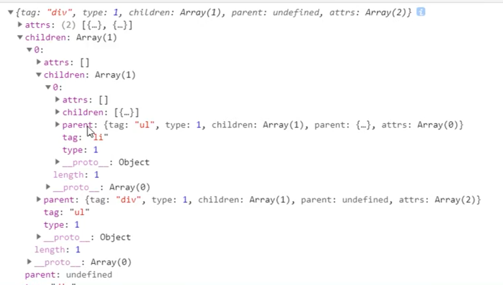

Vue实例化
```javascript
// 
new Vue({
  el: "#app",
  data() {
    return {
      a: 111,
    };
  },
  // render(h) {
  //   return h('div',{id:'a'},'hello')
  // },
  // template:`<div id="a">hello</div>`
});

```

## 1.模板编译入口
```javascript
import { initState } from "./state";
export function initMixin(Vue) {
  Vue.prototype._init = function (options) {
    const vm = this;
    // 在原型方法上，this的指向永远是实例，这里的this代表调用_init方法的对象(实例对象)
    //  this.$options就是用户new Vue的时候传入的属性
    vm.$options = options;
    // 初始化状态
    initState(vm);
    
    // 如果有 el属性，进行模板渲染
    if(em.$options.el) {
      vm.$mount(vm.$options.el)
    }
  };
  
  // 这块代码在源码里面的位置其实是放在entry-runtime-with-compiler.js里面
  // 代表的是Vue源码里面包含了compile编译功能 这个和runtime-only版本需要区分开
  Vue.prototype.$mount = function() {
    const vm = this;
    const options = vm.$options;
    el = document.querySelector(el)
    // 如果不存在 render 属性
    if(!options.render) {
      // 如果存在template属性
      let template = options.template;
      if(!tempalte && el) {
        // 如果不存在render和template，但是存在el属性，
        // 直接将模板赋值到el所在的外层 HTML 结构（就是el本身，并不是父元素）
        template = el.outerHTML
      }
      
      // 最终 需要把template模板转化为render 函数
      if(tempalte) {
        const render = compileToFunction(tempalte);
        options.render = render //调用render方法，渲染成真实的dom，替换掉页面的内容
      }
    }
  }
}
```

## 2.模板转化核心方法 compileToFunction
```javascript
import { parse } from "./parse";
import { generate } from "./codegen";

export function compileToFunction(template) {
  // 我们需要把 HTML 字符串转变为 render函数
  // 1、把 HTML 代码转成 AST 语法树，
  // AST用来描述代码本身形成树形结构，不仅可以描述HTML，也能描述css 以及 js语法
  // 很多库都运用到了ast 比如 webpack babel eslint等等
  
  let ast = parse(template)
  
  // 2、优化静态节点
  // 不影响核心功能，不写实现细节，
  if(options.optimize !== false) {
    optimize(ast, options)
  }
  
  // 3、通过AST，重新生成代码
  // 我们最后生成的代码需要和render函数一样
  // 类似 _c('div',{id:"app"},_c('div',undefined,_v("hello"+_s(name)),_c('span',undefined,_v("world"))))
  // _c代表创建元素， _v代表创建文本， _s代表 JSON.stringify -- 把对象解析成为本
  let Code = generate(ast)
  
  // 使用 with 语法，改变作用域为this，之后调用render函数可以使用 call 函数改变this，方便code里面的变量取值
  let renderFn = new Function(`with(this){return${code}}`)
  return renderFn
}
```
**html => ast（只能描述语法，不能描述语法外的不存在的属性） => render函数+ (with + new Function) => 虚拟dom（增加额外属性）**<br />compiler 文件夹,表示编译相关功能,核心导出 compileToFunctions 函数,<br />主要有三个步骤 1.生成 ast 2.优化静态节点 3.根据 ast 生成 render 函数
## 3.解析 html 并生成 ast

1. ast 是语法层面的对与数据的描述，vdom 只是dom节点
2. 编写正则，匹配开始、结束、属性、变量插入( {{}} ) 等
3. 全局定义根节点和当前父节点，用于ast数据的结构定义
4. 定义一个栈对象，用于梳理树形结构的层级关系（parent 与 children）
5. **在parse 函数中递归，处理当前解析的 模板文件（render 或者 template 内容 或者 传入的 el标签），生成ast的数据结构**，
6. **parseStartTag** 判断是不是标签的开始（无论是开始标签还是结束标签都是带 <  的）
   - 如果是开始标签会详细的正则匹配处理开始标签，开始标签的标签名，标签的属性（while循环，正则匹配），再在正则的过程中，删除字符串，返回 **tagName 和 attrs 数组** 的数据对象
   - 如果不是开始标签，返回false
7. parse 方法 处理无论开始标签、结束标签、还是内容
   - 因为开始标签代表着新一轮的ast数据结构要生成，所以需要通过 **parseStartTag **返回的 对象，传递到 **handleStartTag **中，在 **handleStartTag **调用 **createASTElement** 方法，来生成 ast element， 
   - 在 **handleStartTag **中判断开始标签处，判断是不是根，不是根，根就是自己本身，再把父元素设置为自身，因为开头的标签肯定是当前无论是文字或者子标签的父级，再把自身推进 **stack** 中，
   - 让处理结束标签的方法 **handleEndTag** ，建立parent和children的关系，
   - 对 标签的开始 处理结束后，会走到text的内容，也就是文本的内容，文本如果能匹配到，就使用 handleChars 正则处理文本，生成文本节点数据
   - 编译的过程结束后，每个阶段的标签和内容，将会转化为对象，通过children和parent，将整个template的结构，通过root来组合起来，
   - 在这个过程中， while会不断的进行循环，**parseStartTag **会匹配一些删除一些，直至将所有内容处理完毕
   - parse方法最后会返回一个 root的树形数据结构
```javascript
//匹配标签名 形如 abc-123
const ncname = `[a-zA-Z_][\\-\\.0-9_a-zA-Z]*`; 
//匹配特殊标签 形如 abc:234 前面的abc:可有可无
const qnameCapture = `((?:${ncname}\\:)?${ncname})`; 
// 匹配标签开始 形如 <abc-123 捕获里面的标签名
const startTagOpen = new RegExp(`^<${qnameCapture}`); 
// 匹配标签结束  >
const startTagClose = /^\s*(\/?)>/; 
// 匹配标签结尾 如 </abc-123> 捕获里面的标签名
const endTag = new RegExp(`^<\\/${qnameCapture}[^>]*>`); 
// 匹配属性  形如 id="app"
const attribute = /^\s*([^\s"'<>\/=]+)(?:\s*(=)\s*(?:"([^"]*)"+|'([^']*)'+|([^\s"'=<>`]+)))?/; 


let root, currentParent; // 代表根节点和当前父节点
let stack = []; // 栈结构 来表示开始和结束标签
// 标识元素和文本type
const ELEMENT_TYPE = 1;
const TEXT_TYPE = 3;

// 生成AST 方法
function createASTElement(tagName. attrs) {
  return {
    tag: tagName,
    type:ELEMENT_TYPE,
    children: [],
    attrs,
    parent: null,
  }
}

// 对开始标签进行处理
function handleStartTag({tagName, attrs}) {
  let element = createASTElement(tagName, attrs);
  if(!root) {
    root = element
  }
  currentParent = element;
  stack.push(element);
}

// 对结束标签进行处理
function handleEndTag(tagName) {
  // 栈结构，如 []
  // 比如 <div><span> </span> </div>
  // 当遇到第一个结束标签</span>时，会匹配到栈顶的<span>元素对应的AST，并取出来
  let element = stack.pop()
  // 这里当前父元素就是栈顶的上一个元素 在这里就类似div
  currentParent = stack[stack.length - 1]
  
  // 建立parent和children关系
  if(currentParent) {
    // 当前标签的父是 currentParent
    element.parent = currentParent;
    // currentParent 的孩子要新增一个当前element
    currentParent.children.push(element)
  }
}

// 对文本进行处理
function handleChars(text) {
  // 去掉空格
  text = text.replace(/\s/g, '')
  if(text) {
      currentParent.children.push({
       type: TEXT_TYPE,
       text,
     })
  }
}

// 解析标签生成ast核心
export function parse(html) {
  while (html) {
    // 查找 < 标签的开头，无论是不是开始还是结束标签
    let textEnd = html.indexOf("<");
    // 如果<在第一个 那么证明接下来就是一个标签 不管是开始还是结束标签
    if (textEnd === 0) {
      // 如果开始标签解析有结果
      const startTagMatch = parseStartTag();
      if(startTagMatch) {
        // 把解析好的标签名和属性解析生成ast
        handleStartTag(startTagMatch);
        // 此处是匹配到了开始标签，跳出本次循环，继续下一次开始开始标签的匹配
        continue;
      }
      
      // 匹配结束标签</
      const endTagMatch = html.match(endTag);
      if (endTagMatch) {
        // 截取长度
        advance(endTagMatch[0].length);
        handleEndTag(endTagMatch[1]);
        continue;
      }
    }
    // 开始标签的内容解析完后，开始解析
    let text;
    // 形如 hello<div></div>
    if (textEnd > 0) {
      // 获取文本
      text = html.substring(0, textEnd);
    }
    if (text) {
      advance(text.length);
      handleChars(text);
    }
  }
  
  // 匹配开始标签
  function parseStartTag() {
    const start = html.match(startTagOpen);
    if (start) {
      const match = {
        tagName: start[1], // 标签名
        attrs: [], // 所有的属性
      };
      //匹配到了开始标签 就截取掉
      advance(start[0].length);
      
      // 开始匹配属性
      // end代表结束符号>  如果不是匹配到了结束标签
      // attr 表示匹配的属性
      
      let end, attr;
      // 如果没有遇到标签结尾，说明有属性要处理
      while (
        !(end = html.match(startTagClose)) &&
        (attr = html.match(attribute))
      ) {
        advance(attr[0].length);
        attr = {
          name: attr[1],
          // match的返回值的参数位置
          value: attr[3] || attr[4] || attr[5], //这里是因为正则捕获支持双引号 单引号 和无引号的属性值
        };
        match.attrs.push(attr);
      }
      // 匹配到开始标签的结尾，将字符串截取
      if (end) {
        //   代表一个标签匹配到结束的>了 代表开始标签解析完毕
        advance(1);
        return match;
      }
    } 
    // 不是开始标签
    return false
  }
  //截取html字符串 每次匹配到了就往前继续匹配
  function advance(n) {
    html = html.substring(n);
  }
  //   返回生成的ast
  return root;
}
```
利用正则，匹配 html 字符串，遇到开始标签、结束标签和文本，解析完毕之后生成对应的 ast，并建立相应的父子关联，不断的 advance 截取剩余的字符串，直到 html 全部解析完毕 <br />咱们这里主要写了对于开始标签里面的属性的处理--parseStartTag<br />

## 4.根据 ast 重新生成代码
核心：遍历 AST树，将树结构数据拼接成字符串<br />将AST 传入 generate方法中，通过 getChildren获取AST的children，在生成子节点的时候，调用gen函数进行递归创建，通过 genProps 获取属性，
```javascript
const defaultTagRE = /\{\{((?:.|\r?\n)+?)\}\}/g; //匹配花括号 {{  }} 捕获花括号里面的内容

function gen(node) {
  // 判断节点类型
  // 主要包含处理文本核心
  // 源码这块包含了复杂的处理  比如 v-once v-for v-if 自定义指令 slot等等  咱们这里只考虑普通文本和变量表达式{{}}的处理

  // 如果是元素类型
  if (node.type == 1) {
    //   递归创建
    return generate(node);
  } else {
    //   如果是文本节点
    let text = node.text;
    // 不存在花括号变量表达式
    if (!defaultTagRE.test(text)) {
      return `_v(${JSON.stringify(text)})`;
    }
    // 正则是全局模式 每次需要重置正则的lastIndex属性  不然会引发匹配bug
    let lastIndex = (defaultTagRE.lastIndex = 0);
    let tokens = [];
    let match, index;

    while ((match = defaultTagRE.exec(text))) {
      // index代表匹配到的位置
      index = match.index;
      if (index > lastIndex) {
        //   匹配到的{{位置  在tokens里面放入普通文本
        tokens.push(JSON.stringify(text.slice(lastIndex, index)));
      }
      //   放入捕获到的变量内容
      tokens.push(`_s(${match[1].trim()})`);
      //   匹配指针后移
      lastIndex = index + match[0].length;
    }
    // 如果匹配完了花括号  text里面还有剩余的普通文本 那么继续push
    if (lastIndex < text.length) {
      tokens.push(JSON.stringify(text.slice(lastIndex)));
    }
    // _v表示创建文本
    return `_v(${tokens.join("+")})`;
  }
}

// 处理attrs属性
function genProps(attrs) {
  let str = "";
  for (let i = 0; i < attrs.length; i++) {
    let attr = attrs[i];
    // 对attrs属性里面的style做特殊处理
    if (attr.name === "style") {
      let obj = {};
      attr.value.split(";").forEach((item) => {
        let [key, value] = item.split(":");
        obj[key] = value;
      });
      attr.value = obj;
    }
    str += `${attr.name}:${JSON.stringify(attr.value)},`;
  }
  return `{${str.slice(0, -1)}}`;
}

// 生成子节点 调用gen函数进行递归创建
function getChildren(el) {
  const children = el.children;
  if (children) {
    // 如果有多个children的时候，循环创建新的内容，拼接而成
    return `${children.map((c) => gen(c)).join(",")}`;
  }
}

// 递归创建生成code
export function generate(el) {
  let children = getChildren(el);
  let code = `_c('${el.tag}',${
    el.attrs.length ? `${genProps(el.attrs)}` : "undefined"
  }${children ? `,${children}` : ""})`;
  // 根据孩子有没有来添加逗号
  return code;
}

```
拿到生成好的 ast 之后，<br />需要把 ast 转化成类似<br />_c('div',{id:"app"},_c('div',undefined,_v("hello"+_s(name)),_c('span',undefined,_v("world"))))<br />这样的字符串

## 5.code 字符串生成 render 函数
code中生成的字符串，是有变量的，这些变量是存在vm上的，因此可以用with语法来指定这些变量从this上寻找，在使用 new Function 定义 renderFn的时候，可以调用renderFn的时候，使用call 显示的绑定vm，使得数据指向this
```javascript
export function compileToFunctions(template) {
  let code = generate(ast);
  // 使用with语法改变作用域为this
  // 之后调用render函数可以使用call改变this，方便code里面的变量取值
  // 比如 name值就变成了this.name
  let renderFn = new Function(`with(this){return ${code}}`);
  return renderFn;
}
```

总结<br />1、用户是否传入render，没传入，可能传入的template，如果也没有传，就用 el<br />2、将传入的HTML => 进行词法解析(开始、结束标签，属性、文本) => AST语法树，利用 root stack 来描述 HTML语法， => codegen，将 AST转换为_c,_v类型的语法的字符串 => 让字符串执行


