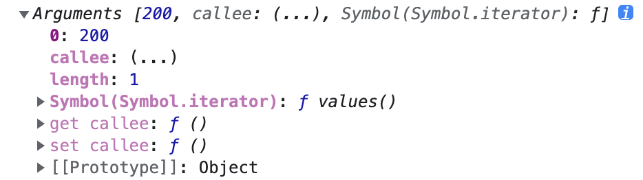

# 防抖、截流

**防抖 （debounce）**

触发事件N秒后才执行函数，如果在N秒内又出发了事件，则会重新计算函数执行时间

防抖函数:，分为非立即执行版和立即执行版

- 非立即执行版:
    
    ```jsx
    function debounce(func, wait) {
    	let timer= null;
    	return function() {
    		const context = this;
    		const args = [...arguments];
    		console.log(arguments)
    		if(timer) clearTimeout(timer);
    		timer = setTimeout(() => {
    			func.apply(context, args)
    		}, wait)
    	}
    }
    
    // 用法
    
    test(text) {
    	console.log(text)
    }
    
    this.debounce(this.test, 2000)(200)
    // 立即打印出 Arguments
    // 两秒后打印 200
    ```
    
    
   
    因为debounce返回的是一个函数，所以需要被调用，
    
    需要debounce的方法，可以在调用debounce的时候出传入参数
    
    使用 apply就可以接收
    
    **暂时没弄懂 为什么this 的值是undefined**
    
    const context = this;
    const args = [...arguments];
    
    使用这两行代码来获取 this 和 参数，
    
    是为了让 debounce 函数最终返回的函数 this 指向不变以及依旧能接受到 e 参数。
    
- 立即执行版:
    
    ```jsx
    function debounce(func, wait) {
    	let timer = null;
    	return function() {
    		const context = this;
    		const args = [...arguments];
    		if(timer) clearTimeout(timer);
    		const callNow = !timer;
    		timer = setTimeout(() => {
    			timer = null
    		}, wait)
    		if (callNow) func.apply(context, args)
    	}
    }
    
    // 用法
    test(text) {
    	console.log(text)
    }
    
    this.debounce(this.test, 2000)(200)
    
    // 立即打印 200
    ```
    
    运用 闭包的原理，执行完debounce，返回新的函数，函数的内部变量引用 denounce，因此debounce内部的变量不会被销毁，会一直存在，然后在执行新的函数的时候，会先判断 debounce内部的变量是否有值，如果有值，将立即执行标志设为反，根据立即执行标志，来判断是否执行方法
    
- 双剑合璧版:
    
    ```jsx
    /**
     * @desc 函数防抖
     * @param func 函数
     * @param wait 延迟执行毫秒数
     * @param immediate true 表立即执行，false 表非立即执行
     */
    function debounce(func, wait, immediate) {
    	let timer;
    	return function() {
    		const context = this;
    		cont args = [...arguments];
    		if(timer) clearTimeout(timer)
    		if(immediate) {
    			const callNow = !timer;
    			timer = setTimeout(() => {
    				timer = null
    			}, wait)
    			if (callNow) func.apply(context, args)
    		} else {
    			timeout = setTimeout(() => {
            func.apply(context, args)
          }, wait);
    		}
    	}
    }
    ```
    

**节流 （throttle）**

指连续触发事件但是在 n 秒中只执行一次函数，节流会稀释函数的执行频率

节流函数，分为时间戳版和定时器版

- 时间戳版:
    
    在持续触发事件的过程中，函数会立即执行
    
    ```jsx
    function throttle(func, wait) {
    	var timer = 0;
    	return function () {
    		let now = Data.now()
    		let context = this;
    		let args = [...arguments]
    		if(now - timer > wait) {
    			func.apply(context, args)
    			timer = now
    		}
    	}
    }
    
    // 用法
    
    test(text) {
    	console.log(text)
    }
    
    this.throttle(this.test, 2000)(200)
    // 两秒后打印 200
    ```
    
- 定时器版:
    
    ```jsx
    function throttle(func, wait) {
    	let timer = null;
    	return function () {
    		let context = this;
    		let args = [...arguments];
    		if(!timer) {
    			timer = setTimerout(() => {
    				timer = null;
    				func.apply(context, args)
    			}, wait) 
    		}
    	}
    }
    ```
    

时间戳版的函数触发是在时间段内开始的时候

而定时器版的函数触发是在时间段内结束的时候